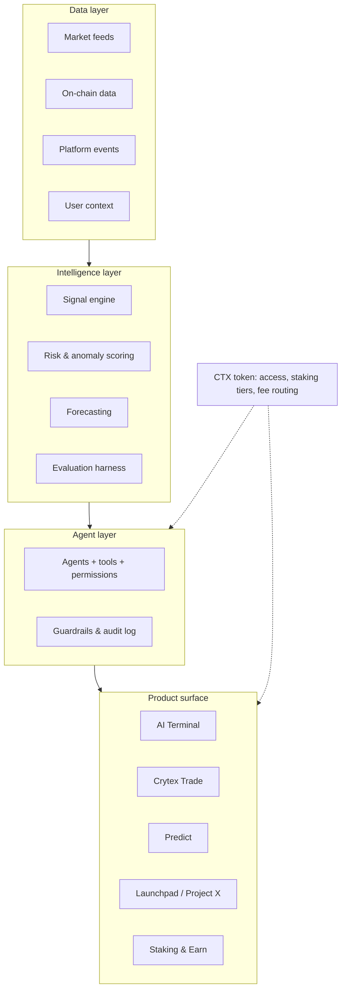

<div align="center">

# Crytex Core

**Open specifications, schemas and SDKs for the Crytex intelligence layer and ecosystem.**

[Vision](docs/00-vision.md) · [Architecture](docs/01-architecture.md) · [Ecosystem](docs/02-ecosystem.md) · [Agents](docs/04-agents.md) · [Roadmap](docs/06-roadmap.md) · [RFCs](rfcs/README.md) · [Русская версия](README.ru.md)

</div>

---

## What this repository is

Crytex is moving from a platform *with* an AI feature to a platform *built on* an intelligence
layer. This repository is the public contract for that move: the architecture, the API and schema
definitions, the agent model, and the process by which all of it changes.

**This repo contains** — specs (`spec/`), architecture and design docs (`docs/`), thin client SDKs
(`sdk/`), runnable examples (`examples/`), and the RFC process (`rfcs/`).

**This repo does not contain** — the platform itself, model weights, trading logic, or anything
that touches customer funds. Those live in private repositories. What is published here is the
*interface* to them, so that integrators, auditors and the community can build against a stable,
reviewable surface.

> **Not financial advice.** Nothing in this repository, and nothing produced by systems described
> in it, constitutes investment advice or a guarantee of returns. See [docs/05-guardrails.md](docs/05-guardrails.md).

---

## The ecosystem at a glance



Four layers, one rule between each: **the layer above may only reach the layer below through a
published schema in `spec/`.** That is what makes the stack auditable and what lets a module be
replaced without rewriting the platform.

---

## Repository map

| Path | What lives there |
| --- | --- |
| [`docs/`](docs/) | Vision, architecture, ecosystem modules, agent model, guardrails, roadmap |
| [`spec/openapi.yaml`](spec/openapi.yaml) | Public HTTP API, OpenAPI 3.1 |
| [`spec/agent-manifest.schema.json`](spec/agent-manifest.schema.json) | What an agent is: tools, permission tier, limits |
| [`spec/events.schema.json`](spec/events.schema.json) | Platform event envelope consumed by the data layer |
| [`sdk/js`](sdk/js) | `@crytexlab/sdk` — zero-dependency browser/Node client |
| [`sdk/php`](sdk/php) | PHP 8.1+ client, for the existing platform codebase |
| [`examples/`](examples/) | Copy-pasteable requests and a minimal agent |
| [`rfcs/`](rfcs/) | How changes to any of the above get proposed and accepted |

---

## Quick start

### 1. Read in this order

1. [`docs/00-vision.md`](docs/00-vision.md) — what we are building and, importantly, what we are not.
2. [`docs/01-architecture.md`](docs/01-architecture.md) — the four layers and their boundaries.
3. [`docs/04-agents.md`](docs/04-agents.md) — the agent model, if you intend to write one.

### 2. Call the API

```bash
export CRYTEX_TOKEN="ctx_live_..."          # issued in Account → API keys

curl -s https://api.crytex.io/v1/signals \
  -H "Authorization: Bearer $CRYTEX_TOKEN" \
  -H "Accept: application/json" \
  -G --data-urlencode "symbols=BTC,ETH,SOL"
```

Every endpoint in [`spec/openapi.yaml`](spec/openapi.yaml) is versioned under `/v1`. Breaking
changes ship as `/v2`; `/v1` stays alive for at least 12 months after that.

### 3. Or use an SDK

```bash
npm install @crytexlab/sdk
```

```js
import { Crytex } from '@crytexlab/sdk';

const ctx = new Crytex({ token: process.env.CRYTEX_TOKEN });

const { signals } = await ctx.signals.list({ symbols: ['BTC', 'ETH'] });
const stream = ctx.agents.stream('terminal', { message: 'Explain the ETH signal' });

for await (const chunk of stream) process.stdout.write(chunk.text ?? '');
```

```bash
composer require crytexlab/sdk
```

```php
$ctx = new Crytex\Client(getenv('CRYTEX_TOKEN'));
$signals = $ctx->signals()->list(['symbols' => ['BTC', 'ETH']]);
```

### 4. Validate a change before you open a PR

```bash
npx @redocly/cli lint spec/openapi.yaml
npx ajv-cli validate -s spec/agent-manifest.schema.json -d examples/agent.manifest.json --spec=draft2020
```

---

## Module status

Status is honest on purpose — `spec` means the document exists and the code does not.

| Module | Status | Spec |
| --- | --- | --- |
| Support concierge (knowledge-base chat) | **live** | [`docs/02-ecosystem.md#support-concierge`](docs/02-ecosystem.md#support-concierge) |
| CTX token, staking, referral, bounty | **live** | [`docs/02-ecosystem.md`](docs/02-ecosystem.md) |
| Predict (event markets) | **live** | [`docs/02-ecosystem.md#predict`](docs/02-ecosystem.md#predict) |
| AI Terminal | **building** | [`docs/03-ai-terminal.md`](docs/03-ai-terminal.md) |
| Signal engine v1 | **building** | [`docs/01-architecture.md#intelligence-layer`](docs/01-architecture.md#intelligence-layer) |
| Agent layer + manifests | **spec** | [`docs/04-agents.md`](docs/04-agents.md) |
| Portfolio risk scoring | **spec** | [`docs/01-architecture.md#intelligence-layer`](docs/01-architecture.md#intelligence-layer) |
| On-chain agent execution | **research** | [`rfcs/README.md`](rfcs/README.md) |

---

## Contributing

Small fixes: open a PR. Anything that changes a schema, an endpoint, a permission tier or the
architecture: open an RFC first — [`rfcs/README.md`](rfcs/README.md) explains the (short) process.
See [`CONTRIBUTING.md`](CONTRIBUTING.md).

## Security

Do not open a public issue for a vulnerability. Report it per [`SECURITY.md`](SECURITY.md).

## License

Code (`sdk/`, `examples/`) — [MIT](LICENSE). Documentation and specifications (`docs/`,
`spec/`, `rfcs/`) — [CC BY 4.0](LICENSE-DOCS).
