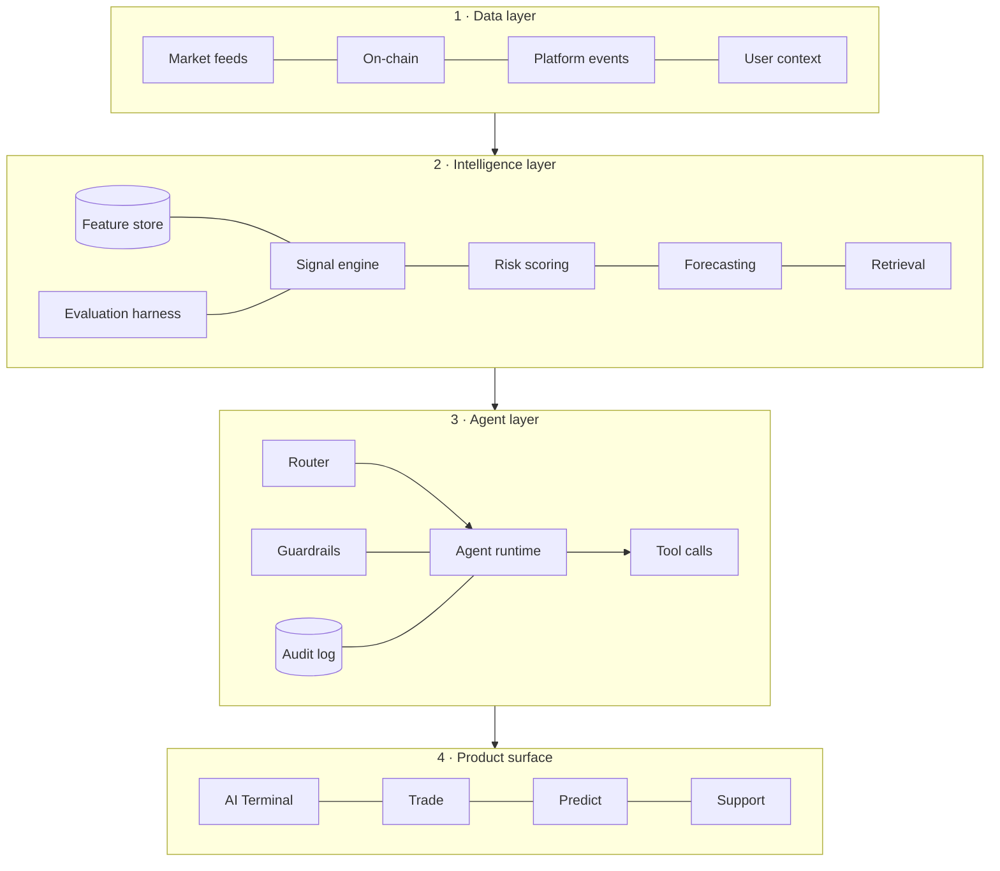

# Architecture

Four layers. Each one talks to the layer below it through a schema published in [`../spec`](../spec),
and through nothing else. That constraint is the whole design — it is what allows any single layer
to be replaced without a rewrite, and what makes an audit tractable.

---

## Data layer

Everything the platform knows, normalised into one event envelope
([`spec/events.schema.json`](../spec/events.schema.json)) and one append-only stream.

| Source | Examples | Freshness |
| --- | --- | --- |
| Market feeds | OHLCV, order book depth, funding rates | seconds |
| On-chain | CTX transfers, staking contract state, wallet flows | block |
| Platform events | deposit, withdrawal requested, stake opened, prediction placed, launchpad subscription | real time |
| User context | account level, tier, locale, open positions, KYC state | on read |

Two rules that are easy to get wrong and expensive to fix later:

- **Events are facts, not commands.** `withdrawal.requested` is a fact. There is no
  `withdrawal.execute` event. Anything that moves money is a call into the platform's own
  authorisation path, never a message on this stream.
- **User context is fetched at query time, never baked into a prompt or an index.** A model that
  memorised a balance will confidently state a stale one.

## Intelligence layer

Stateless services over the data layer. Each exposes a typed endpoint and, critically, each ships
with an evaluation set before it ships to production.

- **Signal engine** — turns market and on-chain state into scored, explained signals. Every signal
  carries its inputs and a plain-language rationale. A signal without a rationale is a bug.
- **Risk and anomaly scoring** — portfolio concentration and drawdown exposure on the user side;
  fraud, bonus abuse and multi-account detection on the platform side. This is where the layer earns
  its keep commercially.
- **Forecasting** — probability distributions, never point predictions. Output is a probability that
  a threshold is crossed, with an interval, and that is also the only form the product surface may
  render.
- **Retrieval** — hybrid keyword and embedding search over documentation, help content and the
  user's own history. Returns document ids, and callers must cite them.
- **Feature store** — the shared definition of a computed input, so that "30-day realised
  volatility" means one thing across signals, risk and forecasting.
- **Evaluation harness** — golden sets, regression runs on every prompt or model change, and cost
  and latency budgets per endpoint. Nothing reaches the agent layer without passing.

## Agent layer

Where models are actually called. Fully specified in [04-agents.md](04-agents.md); the essentials:

- A **router** picks the agent from the user's surface and intent. There is no single mega-prompt.
- An **agent runtime** executes a bounded tool-calling loop (default: 8 steps, 30 s, hard token cap).
- **Guardrails** run before and after every model call: input classification, PII stripping, and
  output checks against the rules in [05-guardrails.md](05-guardrails.md).
- The **audit log** is written synchronously, before a response is returned. If the audit write
  fails, the response does not go out.

## Product surface

The existing platform (PHP/Smarty) and the terminal front end. Its only job with respect to AI is to
render what the agent layer returns, and to own the confirmation dialogs for anything that acts.

Product code must never call a model provider directly. That is the migration's finish line: today
`ai-chat.php` holds prompt assembly, history trimming and a provider call; afterwards it holds an
HTTP call to the agent layer and nothing else.

---

## Cross-cutting concerns

**Keys.** No provider key ever exists in application code, templates or a browser. Provider calls go
through an edge worker that holds the key as a secret and enforces its own origin allowlist, rate
limit and per-day cost ceiling.

**Cost.** Every layer declares a budget. The agent runtime refuses a request it projects will exceed
the per-user daily ceiling, and says so in plain language rather than failing silently.

**Caching.** Deterministic layers (signals, risk) cache on input hash. The agent layer caches the
static prefix of a system prompt. Nothing that includes user context is cached across users.

**Degradation.** Every AI surface has a defined non-AI fallback. If the intelligence layer is down,
Predict still takes positions and the terminal still shows charts. AI is an enhancement to a working
product, never a dependency of one.
