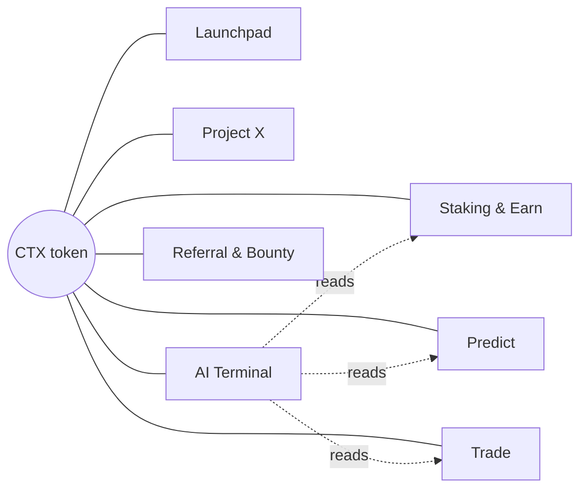

# Ecosystem modules

How each product module relates to the intelligence layer. Status uses the same vocabulary as the
README: **live** (in production), **building** (code exists, not shipped), **spec** (this document
exists, code does not), **research** (open question).

---

## CTX token

**Status: live.** The unit of access, not just of value. Three roles in the AI stack:

1. **Tiering.** Account level (START / ELITE / VIP) is derived from stake, and it sets the agent
   quota: requests per day, model class, and whether the deep-research agent is available at all.
2. **Fee routing.** A share of AI-surface revenue (terminal subscriptions, signal access) is routed
   back into the staking pool, so intelligence-layer usage is visible in staking yield rather than
   being a separate line item.
3. **Metering.** Agent cost is denominated internally in credits, and credits are purchasable in
   CTX. This keeps a runaway prompt from being a silent margin problem.

## Staking and Earn

**Status: live.** Feeds the data layer with position events, and consumes the intelligence layer for
one thing only: explaining a user's own numbers back to them ("why did this position accrue less
this week"). It never recommends a lock period. That is advice, and it is out of scope by
[05-guardrails.md](05-guardrails.md).

## Predict

**Status: live; agent support is spec.** Event markets are the single best fit for the intelligence
layer, because the layer's honest output format — a probability with an interval — is exactly the
market's unit.

The Predict agent is read-and-explain only:

- Summarise a market's history, volume and current spread.
- Surface the base rate for comparable resolved markets.
- State the model's own probability *with* its interval and its inputs.
- Never size a position, never say "take this side".

## Crytex Trade

**Status: live; copilot is building.** The trade copilot is the sharpest permission question in the
system, and it resolves as: the agent may **prepare** an order — instrument, side, size, and the
reasoning — and render it into the confirmation dialog. The user submits it. There is no code path
in which a model's output reaches the exchange adapter without a human click. See
[04-agents.md#permission-tiers](04-agents.md#permission-tiers).

## AI Terminal

**Status: building.** The flagship surface. Specified separately in
[03-ai-terminal.md](03-ai-terminal.md).

## Launchpad and Project X

**Status: live; due-diligence agent is spec.** The intelligence layer's role is structured
extraction, not endorsement: given a project's documents, produce a comparable fact sheet —
tokenomics, vesting schedule, team disclosure, contract verification status, and, explicitly, a list
of what could **not** be verified. The absent-information list is the valuable half and is rendered
with the same weight as the rest.

No score. No ranking. A launchpad that ranks its own listings with an AI is selling a number it
cannot defend.

## Referral and Bounty

**Status: live; anomaly scoring is building.** This is the internal-facing win. The same event
stream that powers user features powers multi-account and bonus-abuse detection: shared devices,
shared funding paths, referral graphs that close on themselves, activity timing that does not look
human.

Scores are advisory and go to a human reviewer with their evidence attached. No account is
restricted by a model alone.

## Mystery Box

**Status: live.** No intelligence-layer role, and this is deliberate. Probabilistic rewards plus an
AI that appears to comment on them is a combination that reads as manipulation regardless of intent.
The agent layer will answer factual questions about odds and nothing else.

## Support concierge

**Status: live.** The knowledge-base chat that exists today. Its migration path, in order:

1. Move the provider call behind the edge worker with an origin allowlist and a shared secret, so
   the endpoint stops being an open proxy.
2. Replace whole-folder prompt stuffing with retrieval, so a request costs a fraction of what it
   costs today.
3. Generate the knowledge base from platform state instead of hand-maintaining text files.
4. Retire it as a standalone service; it becomes one agent among several behind the router.
