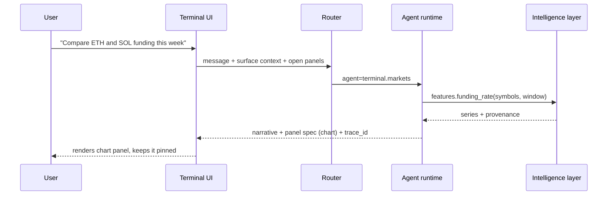

# AI Terminal

**Status: building.**

The Terminal is the surface where the intelligence layer becomes a product rather than a feature. It
is a workspace, not a chat window: a conversation pinned next to live panels that the conversation
can populate.

## What it is

A user asks a question in plain language. The Terminal answers in the panel that fits the answer — a
chart, a table, a signal card, a prepared order ticket — and keeps that panel on the canvas. The
next question can refer to what is on the canvas.

## Panels

The agent does not emit HTML. It emits a **panel spec** — a typed object the front end knows how to
render — which keeps the model away from the DOM and keeps rendering consistent.

| Panel | Emitted when | Contains |
| --- | --- | --- |
| `narrative` | always | Text answer with inline citations to document or feature ids |
| `chart` | a series is the answer | Series ids, window, annotations |
| `table` | a comparison is the answer | Columns, rows, units |
| `signal` | a signal is referenced | Score, rationale, inputs, generated-at |
| `order_ticket` | the user asked to trade | Instrument, side, size, estimated cost — **inert until the user confirms** |
| `disclosure` | any forecast is shown | Interval, model version, what the model cannot see |

An `order_ticket` panel is a rendering instruction, never an instruction to the exchange adapter.
The Terminal front end submits orders through the same authenticated path a manual order uses, after
an explicit click.

## Context the agent receives

- The open panels and their ids (so "that chart" resolves).
- The user's tier and locale.
- Their positions and balances, fetched at request time.
- The last N turns, truncated by token budget rather than by message count.

It does **not** receive: full trade history in the prompt, other users' data in any form, or
anything from the marketing or bonus systems. The Terminal is not a sales surface, and the moment it
becomes one it stops being trusted.

## Non-negotiables

1. **Every number is traceable.** Each figure the Terminal renders resolves to a feature id and a
   generated-at timestamp. Hovering it shows the provenance.
2. **Forecasts always ship with their interval.** A probability without an interval does not render.
3. **The Terminal degrades.** If the intelligence layer is unavailable, panels still render from
   cached market data and the conversation says the layer is down. It does not guess.
4. **No hidden autonomy.** Anything the agent prepared but did not execute is visibly marked as
   prepared.

## Tier behaviour

| | START | ELITE | VIP |
| --- | --- | --- | --- |
| Messages per day | limited | higher | highest |
| Model class | fast | fast + reasoning | reasoning, longer budgets |
| Panels | narrative, chart, table | + signal | + order ticket, deep research |
| History retention | session | 30 days | 30 days + export |

Limits are enforced in the agent runtime, not in the front end. A modified client gets the same
answer from the server.
