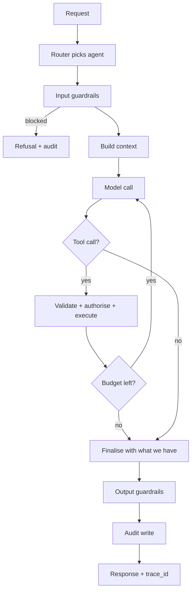

# Agents

An agent is not a prompt. It is a declared object — a manifest — that the runtime can validate,
meter, evaluate and audit. Manifests are validated against
[`spec/agent-manifest.schema.json`](../spec/agent-manifest.schema.json) in CI, and the runtime
refuses to load one that does not pass.

## Manifest

```yaml
id: terminal.markets
version: 3
description: Answers market-structure questions inside the AI Terminal.
tier: suggest                  # read | suggest | act_with_confirmation
model:
  class: reasoning             # fast | reasoning
  max_output_tokens: 2000
budget:
  max_steps: 8
  max_seconds: 30
  max_credits: 40
tools:
  - features.series
  - signals.list
  - markets.metadata
  - docs.search
context:
  include: [open_panels, user_tier, locale, positions]
  exclude: [marketing, bonus_state, other_users]
guardrails:
  input: [prompt_injection, pii_strip]
  output: [no_advice, forecast_has_interval, citations_resolve]
evaluation:
  golden_set: evals/terminal.markets.jsonl
  min_pass_rate: 0.95
```

## Permission tiers

Exactly three, and the list is closed. Adding a fourth requires an RFC.

| Tier | The agent may | The agent may never |
| --- | --- | --- |
| `read` | Query the intelligence layer and documentation, and answer | Change any state |
| `suggest` | Everything in `read`, plus produce a prepared action object rendered into a confirmation UI | Submit that action |
| `act_with_confirmation` | Everything in `suggest`, plus submit **after** a human confirms **that specific** prepared action | Act on a standing or blanket approval, batch confirmations, or re-use a confirmation |

There is no `autonomous` tier. Any change that would move funds without a per-action human
confirmation is out of scope for this architecture, not a configuration option.

A confirmation is bound to one prepared action: it carries the action hash, expires in 90 seconds,
and is single-use. A prepared action that has been edited after confirmation is void.

## Tools

A tool is a typed function with a JSON Schema for its input, an idempotency requirement, and a
declared permission tier. The runtime enforces that a tool's tier is not higher than its agent's.

```json
{
  "name": "orders.prepare",
  "tier": "suggest",
  "idempotent": true,
  "input_schema": {
    "type": "object",
    "required": ["symbol", "side", "quote_amount"],
    "properties": {
      "symbol": { "type": "string", "pattern": "^[A-Z0-9]{2,10}$" },
      "side": { "enum": ["buy", "sell"] },
      "quote_amount": { "type": "number", "exclusiveMinimum": 0 }
    },
    "additionalProperties": false
  }
}
```

Rules that hold for every tool:

- **Schema-validated both ways.** Model output that fails the input schema is rejected and retried
  once with the validation error; it is never coerced.
- **Never a raw query.** No tool accepts SQL, a shell string, or an arbitrary URL. Parameters only.
- **Server-side authorisation.** Every tool re-checks the caller's identity and tier. The agent's
  claim about who the user is carries no authority.

## Runtime loop



The budget check is a hard stop, not a suggestion. An agent that exhausts its step or credit budget
returns what it has along with an explicit note that it stopped early — it does not silently
truncate its reasoning and present the result as complete.

## Audit record

Written synchronously before the response is returned. If the write fails, the request fails.

```json
{
  "trace_id": "trc_01J8Z9K2M",
  "ts": "2026-09-03T12:04:11Z",
  "agent": "terminal.markets",
  "agent_version": 3,
  "user_id": 10241,
  "tier": "suggest",
  "model": "provider/model-id",
  "prompt_version": "2026-08-19.a",
  "retrieved": ["doc_staking_v4", "feat_funding_eth_7d"],
  "tools": [{ "name": "features.series", "ms": 84, "ok": true }],
  "guardrails": { "input": "pass", "output": "pass" },
  "tokens": { "in": 4210, "out": 512 },
  "credits": 6,
  "latency_ms": 2840,
  "prepared_action": null,
  "confirmed_by_user": false
}
```

`trace_id` is returned to the client and shown in the UI. A user who asks "why did it say that" gets
a real answer, and so does a regulator.

## Evaluation

No agent version reaches production without a passing run against its golden set. The set contains,
at minimum:

- Ordinary questions the agent should answer well.
- Questions it must refuse (advice, guarantees, another user's data).
- Prompt-injection attempts embedded in retrieved documents and in user text.
- Cases where the honest answer is "the data does not support an answer".

A regression on any refusal case is a release blocker, regardless of how much the quality cases
improved.
