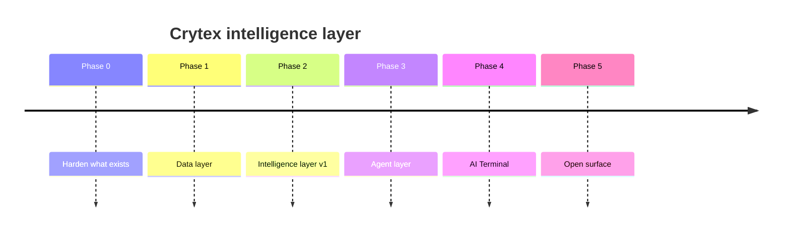

# Roadmap

Phases, not dates. A phase is done when its exit criteria are true, and the next one does not start
before that. Progress is tracked in the repository's issues, and each phase has a milestone.

---

## Phase 0 — Harden what exists

Nothing new is built on an unsafe base.

- Provider calls move behind an edge worker holding the key as a secret, with an origin allowlist, a
  shared client secret, a per-IP rate limit and a per-day cost ceiling.
- Whole-folder prompt stuffing is replaced by retrieval. Target: a support answer costs under 15% of
  what it costs today.
- Every AI request gets a trace id and a structured log line.

**Exit criteria:** the chat endpoint cannot be used as a free model proxy by a third party; median
cost per support answer is down by an order of magnitude; every response is traceable.

## Phase 1 — Data layer

- One event envelope ([`spec/events.schema.json`](../spec/events.schema.json)) and one append-only
  stream.
- Platform emits deposit, withdrawal-requested, stake, prediction and launchpad events into it.
- Market and on-chain ingestion with explicit freshness guarantees per source.

**Exit criteria:** a new consumer can be written against the stream without touching platform code.

## Phase 2 — Intelligence layer v1

- Feature store with versioned definitions.
- Signal engine v1, every signal carrying inputs and a rationale.
- Risk and anomaly scoring, first customer being internal fraud review.
- Evaluation harness in CI, with cost and latency budgets enforced per endpoint.

**Exit criteria:** signals are consumed by a production surface; anomaly scores are used by human
reviewers with evidence attached; no model change ships without a passing eval run.

## Phase 3 — Agent layer

- Manifest schema frozen at v1, runtime validation in CI.
- Router, bounded tool-calling runtime, guardrail pipeline, synchronous audit log.
- Support concierge migrates to being one agent behind the router.
- Permission tiers implemented and tested, including confirmation binding and expiry.

**Exit criteria:** no product code calls a model provider directly; the refusal suite passes; a
prepared action cannot be submitted without a bound, unexpired, single-use confirmation.

## Phase 4 — AI Terminal

- Panel spec, canvas UI, tier enforcement server-side.
- Markets, portfolio and Predict agents.
- Trade copilot at `suggest`, then `act_with_confirmation` only after an external review of the
  confirmation path.

**Exit criteria:** the Terminal is a paid surface with its own retention numbers, and every figure
it renders resolves to a feature id.

## Phase 5 — Open surface

- Public `/v1` API in production with keys issuable from the account area.
- SDKs published to npm and Packagist.
- Third-party agent manifests for launchpad projects, sandboxed at `read` only.
- Public status and cost dashboard for the intelligence layer.

**Exit criteria:** an external developer ships an integration built from `spec/` alone, without
asking us anything.

---

## Research track

Runs alongside, gated by RFCs, and never blocks a phase:

- On-chain agent execution with programmable spending limits — the only plausible route to anything
  more autonomous, because the limit is enforced by the chain rather than by our code.
- Local or self-hosted models for PII-adjacent paths, so sensitive context never leaves our region.
- Verifiable inference, so a user can check that the model that produced a claim is the one we
  named.
